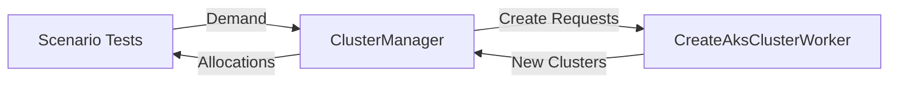

# How to manage clusters for aurora test 

## Scenario test request from Aurora 

- When a scenario test is running in Aurora (each scenario test is running in pod), it contact this phoenix server to request a AKS cluster.
- This phoenix web application will monitor a pool of AKS clusters.
  - If there is a available AKS cluster, it will let one scenario to use that AKS cluster and update the AKS cluster status to `busy`.
  - If there is no available AKS cluster, it will create a new AKS cluster and added to the AKS cluster pool.
- When the scenario test running finished, it will set message to this phoenix web application to update the AKS cluster status to `available`.

constraints:
- Each cluster creation could take about 30 mins.
- The total number of clusters available is limited. 

Questions:
- what communication should scenario test have with phoenix web application? Websocket?
- how to maintain the order of waiting and notify scenario test running from Aurora about the progress of aks cluster creation.

1. Communication Mechanism

For Aurora scenario tests ↔ Phoenix communication:
- Initial request: REST API endpoint (POST /api/cluster-requests)
- Status updates: Phoenix PubSub over WebSocket

```elixir
# ... existing routes ...

scope "/api", HelloWeb do
  post "/cluster-requests", ClusterRequestController, :create
  get "/cluster-requests/:id", ClusterRequestController, :status
end
```

2. Cluster Request Flow 

```elixir
# cluster_request_controller.ex
def create(conn, %{"scenario_id" => scenario_id}) do
  case ClusterManager.request_cluster(scenario_id) do
    {:ok, cluster_id} -> 
      json(conn, %{cluster_id: cluster_id, status: :allocated})
      
    {:wait, request_id} ->
      # Client should subscribe to updates using this request_id
      json(conn, %{request_id: request_id, status: :pending})
  end
end
```

3.  Cluster Management Core

```elixir
defmodule Hello.ClusterManager do
  use GenStage
  
  # Client API
  def request_cluster(scenario_id) do
    GenStage.call(__MODULE__, {:request, scenario_id})
  end

  # Server callbacks
  def init(_) do
    {:producer_consumer, :queue.new(), dispatcher: GenStage.BroadcastDispatcher}
  end

  def handle_call({:request, scenario_id}, from, queue) do
    case AksManagement.get_available_cluster(scenario_id) do
      {:ok, cluster} ->
        # Immediately allocate cluster
        AksManagement.update_cluster_status(cluster.id, :busy)
        {:reply, {:ok, cluster.id}, queue}
        
      {:error, :no_available_cluster} ->
        # Create new cluster and enqueue request
        {:ok, cluster} = create_new_cluster(scenario_id)
        new_queue = :queue.in({from, cluster.id}, queue)
        {:noreply, [], new_queue}
    end
  end

  def handle_info({:cluster_ready, cluster_id}, queue) do
    # Notify waiting requests when cluster becomes available
    case :queue.out(queue) do
      {{:value, {from, ^cluster_id}}, new_queue} ->
        GenStage.reply(from, {:ok, cluster_id})
        {:noreply, [], new_queue}
      
      _ ->
        {:noreply, [], queue}
    end
  end
end
```

4. Cluster status updates 

```elixir
# aks_management.ex
def update_aks_cluster(cluster_id, status) do
  # ... existing update logic ...

  # Broadcast status changes
  HelloWeb.Endpoint.broadcast!("cluster_updates:#{cluster_id}", "status_update", %{
    cluster_id: cluster_id,
    status: new_status
  })

  # Notify ClusterManager when clusters become available
  if new_status == :available do
    send(Hello.ClusterManager, {:cluster_ready, cluster_id})
  end
end
```

Key Advantages:
- Order Preservation: GenStage maintains request order while allowing parallel cluster creation
- Efficient Notification: PubSub broadcasts cluster status changes only to interested parties
- Backpressure Handling: GenStage automatically manages demand between producers and consumers
- Dual Communication Channels:
  - REST API for simple request initiation
  - WebSocket/PubSub for real-time status updates
- Failure Resilience: Requests remain in queue until fulfilled or timeout


Aurora Pod Flow:

1. Request Cluster:

```bash
curl -X POST http://phoenix-server/api/cluster-requests -d '{"scenario_id":"123"}'
```

2. Handle Response:

- If allocated: Use cluster immediately
- If pending: Open WebSocket connection to ws://phoenix-server/socket/cluster_updates/:request_id
- Listen for status_update events

3. Release Cluster (after test):

```bash
curl -X PUT http://phoenix-server/api/clusters/:cluster_id/release
```

This approach combines Elixir's strength in real-time communication (Phoenix Channels) with GenStage's backpressure management, while maintaining compatibility with Kubernetes pod lifecycle requirements.


## Clarify the roles in the proposed architecture

1. ClusterManager (GenStage)

Role: Coordinator/Backpressure Manager
Responsibility:
  Maintains request queue
  Orchestrates cluster allocation
  Manages backpressure between:
    Producers: CreateAksClusterWorker processes (cluster creation)
    Consumers: Scenario test requests (cluster consumption)


2. ClusterRequestController (Phoenix Controller)

Role: API Endpoint
Responsibility:
  Receives initial HTTP requests
  Interfaces with ClusterManager
  Returns immediate responses (allocated cluster IDs or wait instructions)


3. Producer-Consumer Relationships:



True Producers: CreateAksClusterWorker instances (create cluster resources)
True Consumers: Scenario Tests (consume cluster resources)
ClusterManager acts as:
  Consumer of cluster creation events
  Producer of cluster allocations

This design pattern is called the "Broker Pattern" where ClusterManager mediates between actual producers and consumers while managing backpressure through GenStage's demand control mechanism.


## GenStage behavior

- Only the ClusterManager needs to implement GenStage behavior.
- Only ClusterManager implements GenStage
Other modules interact through standard patterns:
  ClusterRequestController: Regular Phoenix controller
  CreateAksClusterWorker: Standard Oban worker
  Scenario tests: External HTTP clients
The GenStage implementation is contained within the ClusterManager to:
  Manage backpressure internally
  Maintain request queue state
  Coordinate between cluster producers (Oban workers) and consumers (external requests)


## ClusterManager as producer and comsumer 

why this works?

- GenStage's type (:producer_consumer) allows dual functionality
- Message passing (send/2) bridges between Oban workers and GenStage
- The queue maintains state between production and consumption phases


```elixir
# cluster_manager.ex
def init(_) do
  # This single module handles both roles
  {:producer_consumer, :queue.new(), dispatcher: GenStage.BroadcastDispatcher}
end

# Handles consumer-side requests
def handle_call({:request, scenario_id}, from, queue) do
  # ... 
end

# Handles producer-side notifications
def handle_info({:cluster_ready, cluster_id}, queue) do
  # ...
end
```

## If split into producer and consumer 

```mermaind
sequenceDiagram
    participant Client as Aurora Pod
    participant Controller as ClusterRequestController
    participant Consumer as ClusterConsumer
    participant Producer as ClusterProducer
    participant Oban as Oban Workers
    participant DB as Database
    
    Client->>Controller: POST /api/cluster-requests
    Controller->>Consumer: request_cluster()
    
    alt Cluster Available
        Consumer-->>DB: Get available cluster
        DB-->>Consumer: Cluster ID
        Consumer-->>DB: Mark as busy
        Consumer-->>Controller: Immediate response
        Controller-->>Client: 200 OK (cluster_id)
    else Need Creation
        Consumer->>Producer: Demand clusters
        Producer->>Oban: CreateClusterWorker1..N
        Oban->>DB: Create cluster (30min)
        Oban-->>Producer: Cluster created
        Producer-->>Consumer: New cluster event
        Consumer-->>DB: Mark as busy
        Consumer-->>Controller: Deferred response
        Controller-->>Client: 202 Accepted (request_id)
        
        par WebSocket Updates
            Client->>Controller: WS connect
            Consumer-->>Controller: Status update
            Controller-->>Client: cluster_allocated
        end
    end
    
    Client->>Controller: PUT /clusters/:id/release
    Controller->>DB: Mark available
    DB->>Consumer: Cluster available
    Consumer->>Consumer: Assign to next request
```

## References 

- [Phoenix -- Channel introduction](https://hexdocs.pm/phoenix/channels.html)
- [Phoenix.Channel behaviour](https://hexdocs.pm/phoenix/Phoenix.Channel.html)
- [Writing a Channels Client for Phoenix](https://hexdocs.pm/phoenix/writing_a_channels_client.html)